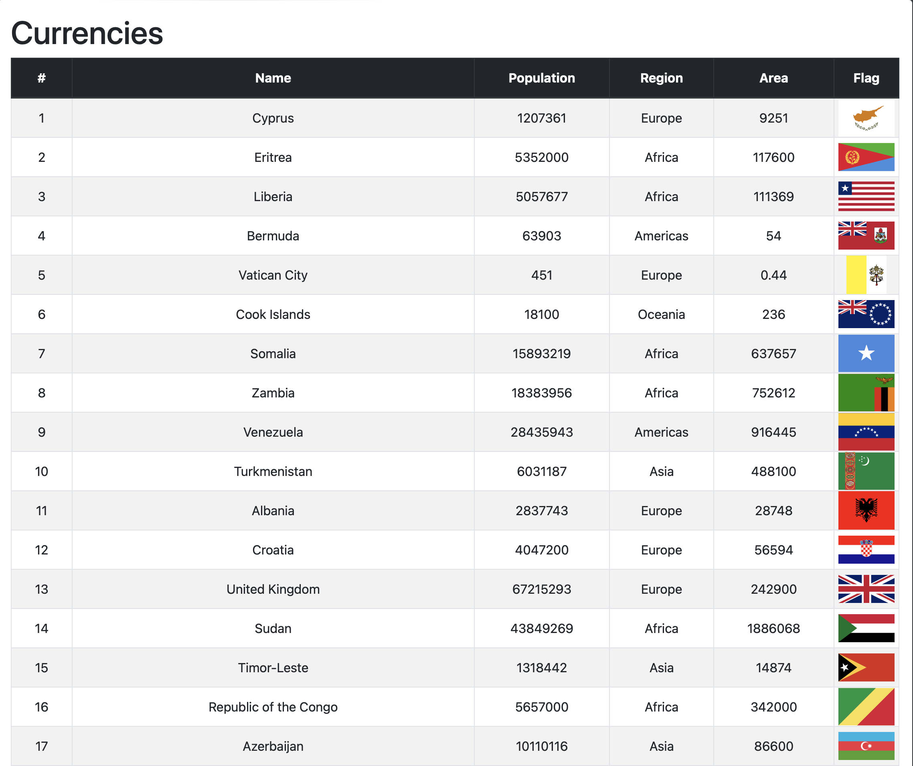
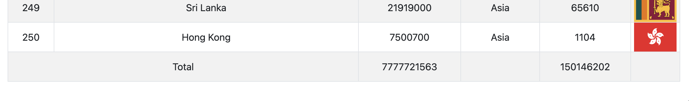

<h1>Название проекта: Таблица стран</h1>

<h2>Описание проекта</h2>

Этот проект представляет собой веб-приложение/инструмент (в зависимости от вашего проекта), которое отображает таблицу стран с различной информацией, такой как Название страны, население, регион, площадь, флаг и т.д. Проект направлен на облегчение доступа к информации о странах мира для исследователей, студентов и любопытных людей.

<h2>Особенности</h2>

Этот проект предоставляет детализированную информацию о странах мира, сфокусированную на следующих ключевых данных:
<ul>
<li>Название страны (Name): Показывает официальное название страны, позволяя пользователям легко идентифицировать каждую страну в таблице.</li>
<li>Население (Population): Предоставляет актуальные данные о численности населения страны, что является важным показателем для социально-экономических исследований.</li>
<li>Регион (Region): Информация о географическом регионе, к которому принадлежит страна, помогает понять глобальное распределение стран и их соседей.</li>
<li>Площадь (Area): Данные о площади страны в квадратных километрах дают представление о размере территории, что может быть полезно для географических и экологических исследований.</li>
<li>Флаг (Flag): Визуальное представление флага каждой страны добавляет красочный и легко узнаваемый элемент интерфейса, позволяя пользователям быстро ассоциировать информацию с соответствующей страной.</li>
<li>Вместе эти данные предоставляют полезный набор информации для людей, исследующих географические, демографические и социальные аспекты стран мира. Веб-приложение позволяет фильтровать и сортировать страны по любому из этих параметров, облегчая поиск и анализ информации.</li>
</ul>
<h2>Технологии</h2>
<ul>
<li>HTML/CSS для структуры и стилей страницы.</li>
<li>JavaScript (или TypeScript) для интерактивности и динамических элементов.</li>
<li>API для получения данных о странах. ( Ресурс https://restcountries.com )</li>
</ul>
<h2>Демонстрация</h2>
<h3>Cсылки на проект, скриншоты интерфейса.</h3>
<a href="https://vladiki23.github.io/js1/"><---- Ссылка ----></a>

